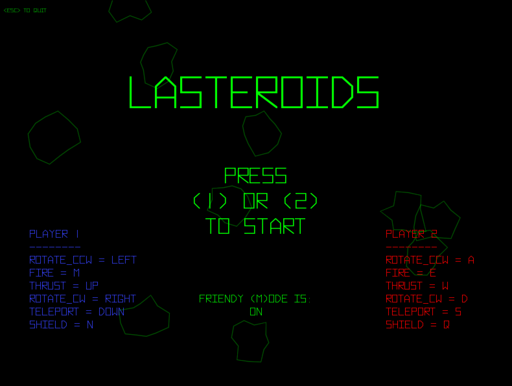

# lasteroids

An asteroids-like game written in love2d



## Overview

Built as an experiment in learning lua, this is a fairly basic Asteroids clone.

## How to run it

Lasteroids uses the [love2d](https://love2d.org/) engine, so you'll likely want to download that and run it using this directory as input.  (Or you can grab an executable from the release pages, but the value of this repo is likely more in the code examples for people learning love2d and lovetoys than actually playing the game...)

## Built With
* The [love2d](https://love2d.org/) framework
* [lovetoys](https://github.com/lovetoys/lovetoys) - for ECS
* [HC](https://hc.readthedocs.io/en/latest/index.html) - for banging rocks together (collision detection)
* [baton](https://github.com/tesselode/baton) - neeed inpuuut!
* [hump](https://github.com/vrld/hump) - vectors and gamestate
* [Binocles](https://github.com/maromaroXD/Binocles) - debugging, for when you're feeling introspective
* [Hyperspace](https://www.pixelsagas.com/?download=hyperspace) - an awesome font from Pixel Sagas
* [boon](https://github.com/camchenry/boon) - for builds

## Thanks To

* Atari, for the [original Asteroids](https://en.wikipedia.org/wiki/Asteroids_(video_game)), the first game I remember playing in an arcade.
* [retrogamedeconstructionzone.com](http://www.retrogamedeconstructionzone.com/2019/10/asteroids-by-numbers.html), for an article with some useful numbers
* Mom and Dad, for all those quarters.


## Authors

* **Luke Hankins** - [lukehankins](https://github.com/lukehankins)

## License
```
Other than the items mentioned in the "Built With" section, this is free and unencumbered software released into the public domain.

Anyone is free to copy, modify, publish, use, compile, sell, or
distribute this software, either in source code form or as a compiled
binary, for any purpose, commercial or non-commercial, and by any
means.

In jurisdictions that recognize copyright laws, the author or authors
of this software dedicate any and all copyright interest in the
software to the public domain. We make this dedication for the benefit
of the public at large and to the detriment of our heirs and
successors. We intend this dedication to be an overt act of
relinquishment in perpetuity of all present and future rights to this
software under copyright law.

THE SOFTWARE IS PROVIDED "AS IS", WITHOUT WARRANTY OF ANY KIND,
EXPRESS OR IMPLIED, INCLUDING BUT NOT LIMITED TO THE WARRANTIES OF
MERCHANTABILITY, FITNESS FOR A PARTICULAR PURPOSE AND NONINFRINGEMENT.
IN NO EVENT SHALL THE AUTHORS BE LIABLE FOR ANY CLAIM, DAMAGES OR
OTHER LIABILITY, WHETHER IN AN ACTION OF CONTRACT, TORT OR OTHERWISE,
ARISING FROM, OUT OF OR IN CONNECTION WITH THE SOFTWARE OR THE USE OR
OTHER DEALINGS IN THE SOFTWARE.

For more information, please refer to <http://unlicense.org/>
```